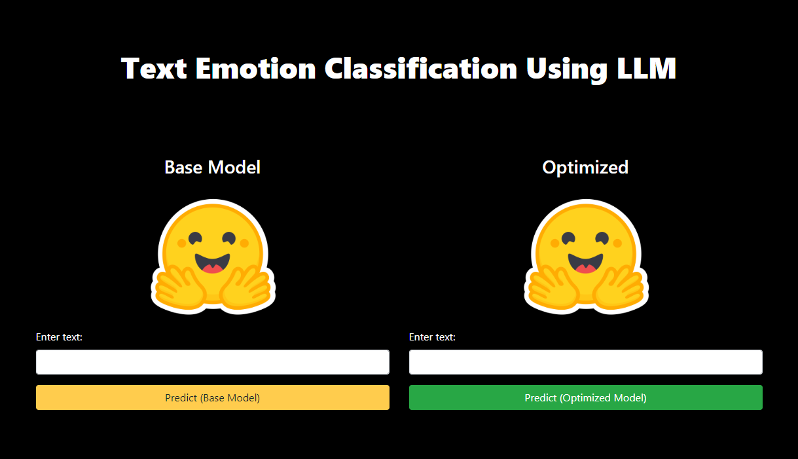
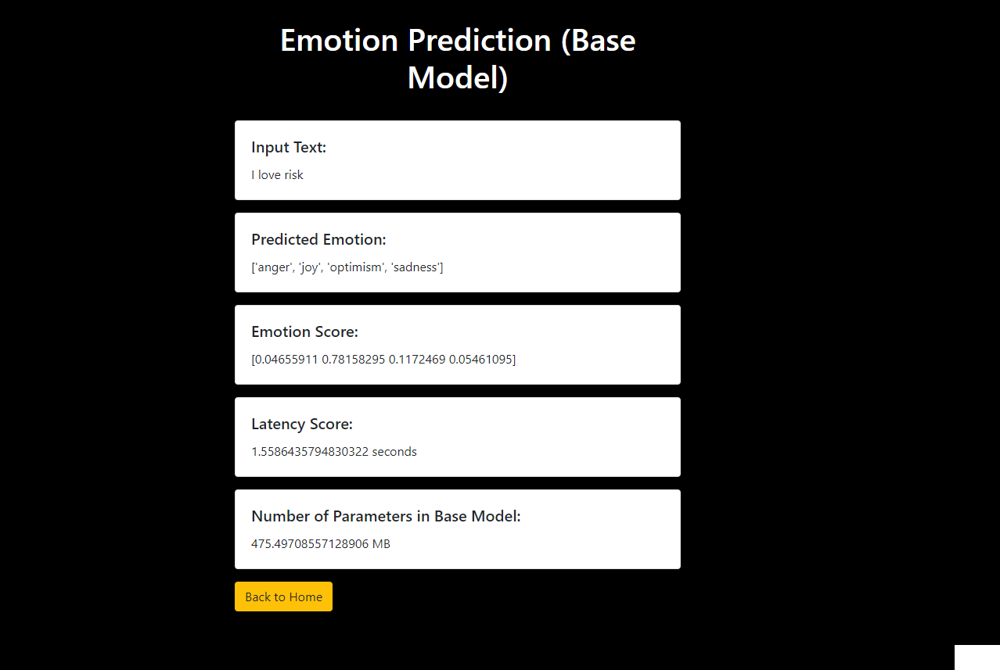
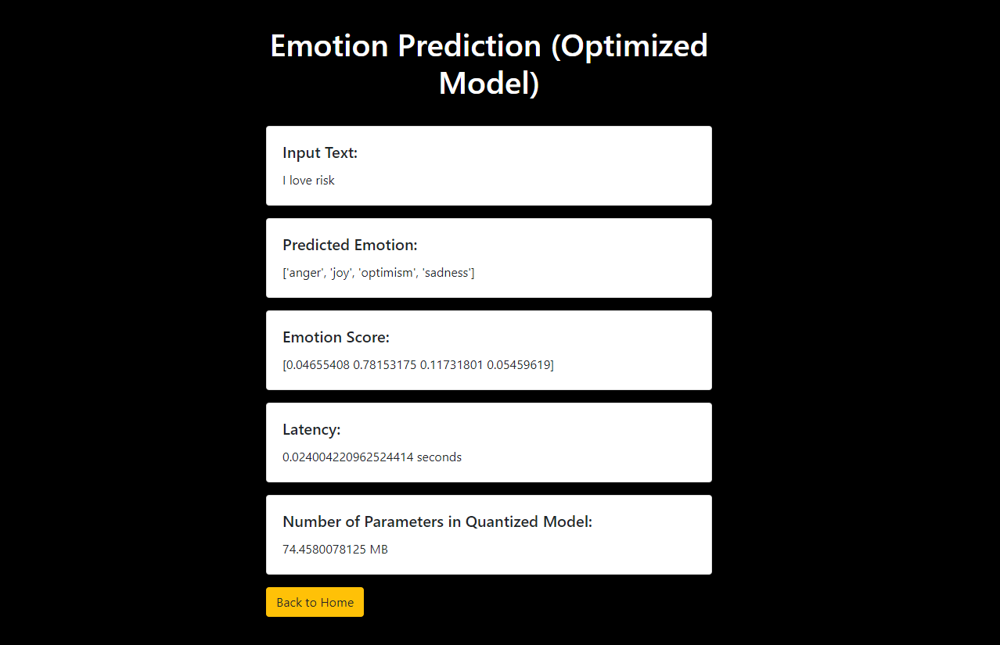

# LLM-Optimization-roberta-emotion
I optimized the RoBERTa model, achieving a size and latency reduction to at least 40% of the base model. Key components of this process include:

1. Quantization: Utilizing torch.quantization.quantize_dynamic from PyTorch's quantization module to convert specific linear layers within the base_model to lower precision, typically 16-bit floating-point, while preserving functionality.

2. Web Service: Created interactive UI using HTML, CSS and Bootstrap and separate POST endpoints for both the base and optimized models using Flask in Python.

3. Containerization: Dockerizing the entire application and pushing the resulting image to Docker Hub. This encapsulates the application and its dependencies for easier deployment and management in various environments.

Enjoy Coding!
